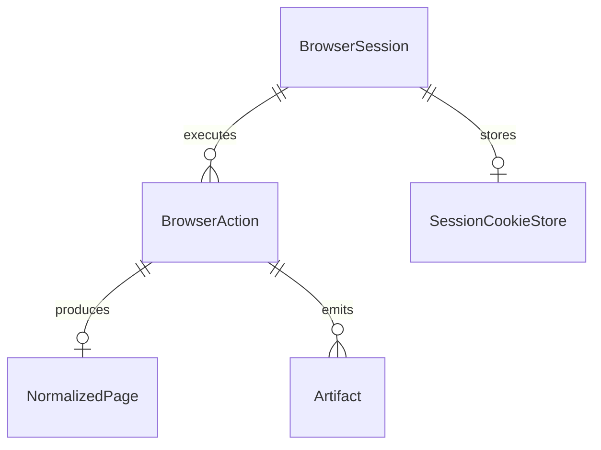

# Data Model and ERD

## Core Entities

- `BrowserSession`
- `BrowserAction`
- `NormalizedPage`
- `Artifact`
- `SessionCookieStore`

## Entity Intent

- `BrowserSession`: reusable session identity and metadata
- `BrowserAction`: one issued MCP/browser action
- `NormalizedPage`: normalized representation returned to the agent
- `Artifact`: raw HTML, screenshot, or trace reference
- `SessionCookieStore`: persisted browser cookie state

## Suggested Relationships

## Required Stored Context

### `BrowserSession`

- `id`
- `status`
- `profile_name`
- `site_scope`
- `last_active_at`

### `BrowserAction`

- `id`
- `session_id`
- `action_type`
- `request_payload`
- `status`
- `started_at`
- `finished_at`

### `NormalizedPage`

- `id`
- `action_id`
- `url`
- `title`
- `semantic_summary_json`
- `actionable_view_json`
- `metrics_json`

### `Artifact`

- `id`
- `action_id`
- `artifact_type`
- `storage_ref`
- `created_at`

Reference docs:

- [06-data-model.md](/Users/soo/workspace/steel-platform/documents/06-data-model.md)
- [13-session-lifecycle.md](/Users/soo/workspace/steel-platform/documents/13-session-lifecycle.md)
- [20-artifact-access-contract.md](/Users/soo/workspace/steel-platform/documents/20-artifact-access-contract.md)
