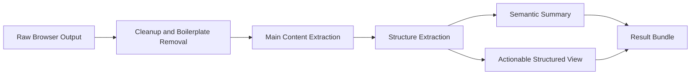

# Steel Content Normalizer Specification

## Purpose

The Content Normalizer exists to reduce token waste without breaking browser action accuracy.

Its job is not simply to summarize.

Its job is to:

- remove noise
- preserve page meaning
- preserve action-relevant structure
- provide compact outputs to the AI agent

## Core Objective

The central design rule is:

- noise reduction without action loss

## Inputs

The normalizer may receive:

- raw HTML
- visible DOM text
- extracted links
- extracted buttons
- extracted inputs and forms
- page title and URL
- screenshots or screenshot references
- optional network summaries

## What Should Be Removed or Reduced

Examples of low-value content that should usually be filtered:

- analytics scripts
- tag manager code
- tracking pixels
- marketing scripts
- repeated nav/footer wrappers
- large hydration blobs
- excessive class strings
- inline style noise
- low-signal data attributes
- invisible boilerplate sections with no interaction value

## What Must Usually Be Preserved

Examples of high-value information that should usually remain:

- page title
- main visible content
- links and href values
- button text
- form grouping
- input labels
- input names and types
- disabled state
- visibility hints
- selector hints or stable identifiers

## Dual Output Strategy

The normalizer should produce two different views.

### 1. Semantic Summary

Used for reasoning.

Contains:

- page type
- compact main content
- major sections
- short explanation of the page's purpose

This output may be more aggressively simplified.

### 2. Actionable Structured View

Used for execution.

Contains:

- links
- buttons
- inputs
- forms
- selector hints
- labels
- action-relevant metadata

This output should be conservative and accuracy-focused.

## Example Output Shape

```json
{
  "page_meta": {
    "url": "https://example.com",
    "title": "Example"
  },
  "semantic_summary": {
    "page_type": "article",
    "main_content_markdown": "# Example\n\nSummary text",
    "important_sections": ["Overview", "Details"]
  },
  "actionable_view": {
    "buttons": [
      {
        "id": "btn_1",
        "text": "Login",
        "selector_hint": "button.login",
        "visible": true,
        "disabled": false
      }
    ],
    "links": [
      {
        "id": "lnk_1",
        "text": "Pricing",
        "href": "/pricing"
      }
    ],
    "inputs": [
      {
        "id": "inp_1",
        "label": "Email",
        "type": "email",
        "name": "email"
      }
    ]
  },
  "artifacts": {
    "raw_html_ref": "artifact://page/123/raw-html",
    "screenshot_ref": "artifact://page/123/screenshot"
  }
}
```

## Normalization Pipeline



## Safety Rules

### Do Not Rewrite Action Truth

The normalizer must not invent buttons, links, or fields that do not exist.

### Preserve a Fallback Path

Raw HTML and screenshot references should remain available for debugging or re-checking.

### Keep Execution Data Conservative

If the summary says "there seems to be a login button" but the actionable view is uncertain, the system should defer to the browser state, not the summary.

## Rule-Based First, SLM Optional

The first version of the normalizer should be mostly rule-based.

Examples:

- readability-style extraction
- script removal
- visible structure extraction
- main text cleanup

An optional local SLM can later improve:

- page type classification
- compression quality
- content ranking
- short semantic labeling

## Success Criteria

The normalizer is successful if it:

- significantly reduces tokens sent to large models
- preserves enough structure for reliable next actions
- makes the agent's browsing loop faster and more accurate

