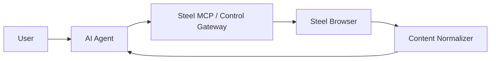

# Steel MCP and Browser Integration

## Purpose

This document explains how Steel MCP should fit into the broader platform.

## Key Position

Steel MCP is not the whole platform.

It is the agent-facing control layer that allows the AI agent to request browser actions.

## Integration Model

## Steel MCP Responsibilities

- receive browser tool requests from the AI agent
- translate those requests into Steel Browser operations
- return browser results into the normalization pipeline
- maintain enough context to support multi-step browsing

## Steel Browser Responsibilities

- execute page actions
- hold live browser state
- expose the browser API
- provide raw execution artifacts

## Why MCP Alone Is Not Enough

MCP solves the interface problem between the agent and the tool.

It does not solve:

- token optimization
- noisy HTML cleanup
- session persistence strategy
- artifact management
- debugging policy

## Recommended Integration Patterns

### Pattern A: Local Agent, Remote Browser

- AI agent runs on the user machine
- Steel Browser runs on the home server
- MCP process runs near the agent

This is simple and good for personal setups.

### Pattern B: Remote Agent Platform

- AI agent talks to a remote MCP or control gateway
- Steel Browser remains on the home server
- results pass through a normalizer before returning

This is better for centralized shared usage.

## Recommended Platform Position

For the long-term service model, use:

- Steel Browser as the execution backend
- Steel MCP or a custom control gateway as the command interface
- Content Normalizer as the result optimization layer

## Suggested Browser Commands

The agent-facing control layer should support at least:

- open page
- click
- type
- submit
- wait for page state
- extract main content
- capture screenshot
- list buttons, links, and forms

## Result Handling Rule

The control layer should not pass large raw HTML outputs directly to the AI agent by default.

Instead:

1. collect browser output
2. normalize it
3. optionally compress it
4. return compact structured results

## Debug Rule

If execution fails or the agent appears confused:

- inspect screenshots
- inspect raw HTML references
- inspect live browser state
- use DevTools privately when needed

