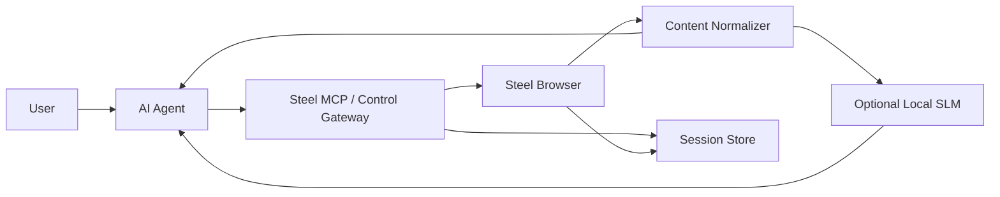
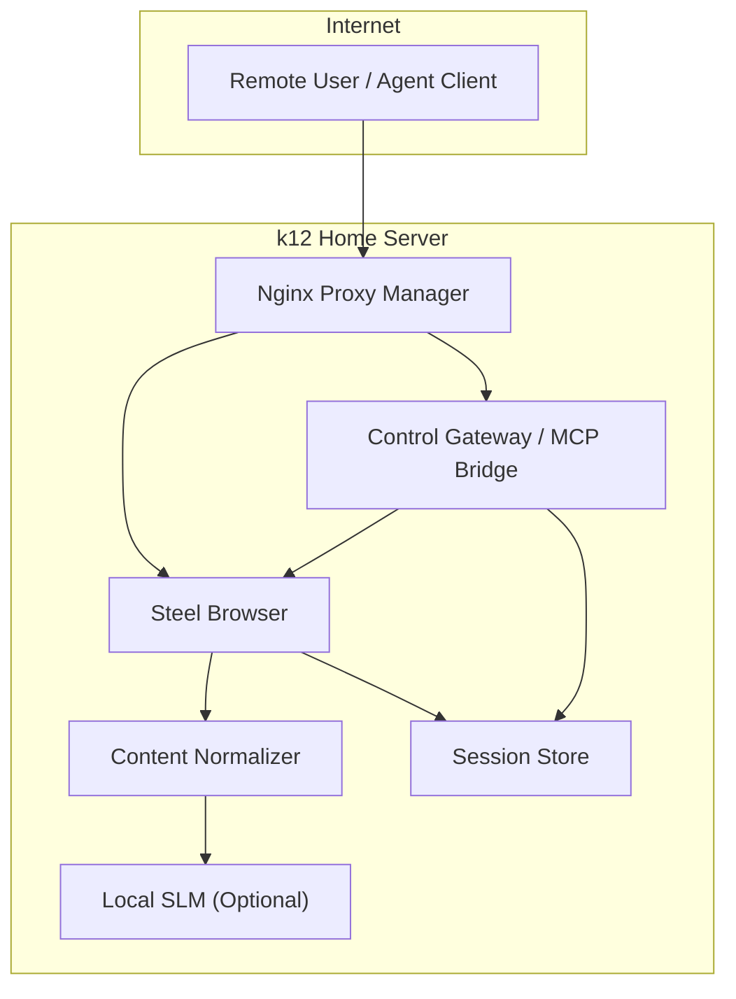

# Steel Platform Architecture Overview

## Purpose

This document describes the overall architecture of the Steel-based browser automation platform.

The platform is designed to:

- improve browser automation reliability
- support AI-agent-driven workflows
- reduce token waste before large-model reasoning
- centralize browser execution on the home server

## Core Components

### 1. User

The human operator who issues high-level requests.

Examples:

- visit a site and extract data
- log in and complete a workflow
- inspect a video page
- gather structured information for downstream automation

### 2. AI Agent

The reasoning layer that interprets user goals and decides what browser actions are needed.

Responsibilities:

- choose tools
- plan steps
- interpret normalized results
- decide next actions or final output

### 3. Steel MCP or Control Gateway

This is the browser control interface used by the AI agent.

Responsibilities:

- accept tool-level browser requests from the agent
- translate them into browser operations
- coordinate browser sessions
- return browser results into the platform pipeline

### 4. Steel Browser

The browser execution runtime.

Responsibilities:

- open and control sessions
- navigate pages
- support automation on dynamic or hostile websites
- produce raw page artifacts

### 5. Content Normalizer

The token optimization and representation cleanup layer.

Responsibilities:

- remove noisy markup
- extract the page's meaningful structure
- preserve action-relevant UI information
- return compact JSON or Markdown

### 6. Optional Local SLM

A lightweight local model used only where it improves preprocessing quality.

Responsibilities:

- classify page type
- compress extracted content
- rank relevant content blocks
- help produce small structured outputs

### 7. Session Store

A persistence layer for browser state.

Responsibilities:

- cookies
- auth state
- session reuse
- login recovery support

## Logical Architecture

## Service Boundaries

### Publicly Accessible

- reverse-proxied Steel Browser API endpoint
- optional remote control gateway endpoint

### Internal Only

- DevTools/debug endpoint
- session store
- artifact storage
- optional local SLM endpoint

## Deployment View

## Design Principles

### Reliability First

Steel Browser exists to improve real browser execution compared with fragile local-only automation flows.

### Normalization Before Reasoning

Do not send raw HTML to larger models unless necessary.

### Separate Understanding from Action

The platform should distinguish:

- semantic summaries for reasoning
- actionable structured data for execution

### Keep Debug Access Private

Do not expose DevTools interfaces publicly unless there is a very specific and well-controlled reason.

## Final Positioning

This platform is not just:

- Playwright in Docker
- Steel Browser with reverse proxy
- a raw MCP endpoint

It is:

- a browser runtime platform
- an AI-agent integration layer
- a token-optimized web interaction pipeline

