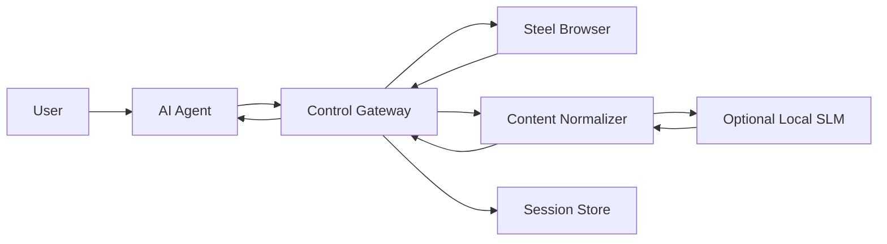

# Steel Platform Build Specification

## 1. Purpose

This document is the implementation-ready specification for the Steel platform.

It should be detailed enough that another AI coding agent can use it to begin building the system with minimal ambiguity.

## 2. Product Goal

Build a Steel-based browser automation platform that:

- is more reliable than plain Playwright in difficult sites
- can be used by AI agents through an MCP or control-gateway layer
- minimizes token waste by normalizing browser output before large-model reasoning
- supports persistent sessions, debugging, and production-style operations

## 3. Non-Goals

The first implementation does not need to:

- support every possible browser action
- replace full general-purpose RPA products
- host a large local LLM as the main reasoning engine
- expose DevTools publicly

## 4. Target Environment

### Host

- device: Gemtek k12 mini PC
- RAM: 16GB
- GPU: Radeon 780M iGPU
- OS: Ubuntu 24.04 LTS

### Existing Services

- Nginx Proxy Manager
- Docker / Portainer
- `holab` Docker network
- external domain routing through DuckDNS

## 5. Required Services

### 5.1 steel-browser

Status:

- already deployed or deployable in Docker

Responsibility:

- provide browser runtime and browser API

Requirements:

- run as always-on container
- expose API port `3000`
- optionally bind `9223` locally for debug
- be reverse-proxied through Nginx Proxy Manager

### 5.2 control-gateway

Responsibility:

- provide agent-friendly browser actions
- optionally bridge to Steel MCP semantics
- manage request lifecycle between agent and browser

Requirements:

- expose HTTP API
- support authenticated callers
- call Steel Browser API
- invoke Content Normalizer after browser actions
- return normalized results instead of raw HTML by default

### 5.3 content-normalizer

Responsibility:

- reduce token-heavy browser output
- preserve action-relevant browser structure

Requirements:

- accept browser result payloads
- remove low-value markup noise
- extract meaningful page structure
- produce:
  - semantic summary
  - actionable structured view
  - artifact references

### 5.4 session-store

Responsibility:

- persist cookies and session metadata

Requirements:

- support lookup by session ID
- store auth/session state
- allow browser sessions to be reused

### 5.5 local-slm (optional)

Responsibility:

- improve content classification and compression

Requirements:

- not required for first milestone
- should be pluggable
- should never be the only source of action truth

## 6. Recommended Implementation Stack

### control-gateway

Recommended:

- Python FastAPI

Reason:

- quick implementation
- strong JSON handling
- easy integration with async HTTP clients

### content-normalizer

Recommended:

- Python FastAPI service
- `trafilatura`
- `readability-lxml`
- `beautifulsoup4`
- `lxml`

### session-store

Recommended:

- SQLite for MVP
- Redis optional later for queues and transient coordination

### local-slm

Recommended options:

- Ollama
- llama.cpp server

## 7. System Responsibilities by Boundary

### Browser Truth Boundary

Source of truth:

- Steel Browser

This includes:

- live DOM state
- page navigation state
- actual UI existence
- real session behavior

### Representation Boundary

Source of compact AI-facing representation:

- Content Normalizer

This includes:

- semantic summary
- actionable structured view
- token-optimized outputs

### Decision Boundary

Source of step planning:

- AI agent

This includes:

- selecting next actions
- deciding whether to continue browsing
- deciding whether to ask for raw artifacts

## 8. Key Design Rule

The system must separate:

- understanding data
- action data

This means every normalized page result should preferably include:

- semantic summary
- actionable structured view
- artifacts

## 9. Required Functional Capabilities

### Browser Action Capabilities

The first implementation should support:

- open URL
- click element
- type text
- wait for selector or stable page state
- capture screenshot
- extract page result

### Normalization Capabilities

The first implementation should support:

- remove scripts and styles
- reduce irrelevant attributes
- remove boilerplate navigation/footer layout when safe
- extract visible text
- extract links, buttons, inputs, and forms
- produce Markdown summary
- produce compact JSON action model

### Session Capabilities

The first implementation should support:

- create session
- reuse session
- attach a request to a session
- store and load cookie state

## 10. Required Non-Functional Capabilities

### Reliability

- each action should return structured status
- failures must be observable
- retries should be possible at the control layer

### Security

- all public endpoints must be authenticated
- debug ports must remain private
- raw browser artifacts should not be casually exposed

### Observability

- request IDs
- session IDs
- logs for browser action start and end
- normalization size before and after cleanup

## 11. MVP Deliverables

The MVP is complete when all of the following are true:

1. a remote request can reach the browser runtime through the control layer
2. the browser can open a page and return structured results
3. the structured result is normalized before the agent consumes it
4. the result includes both summary and actionable views
5. cookies or session state can be reused across requests

## 12. Suggested Service Interaction

## 13. Build Order

1. deploy and confirm `steel-browser`
2. implement `content-normalizer`
3. implement `control-gateway`
4. add `session-store`
5. add optional `local-slm`
6. add observability and hardening

## 14. Definition of Done

The system is considered build-complete for the first milestone when:

- an AI agent can issue browser tasks
- the browser task completes against a real website
- the result is normalized into useful compact output
- the agent can use that output to continue browsing
- the platform can recover enough context to perform multi-step tasks

