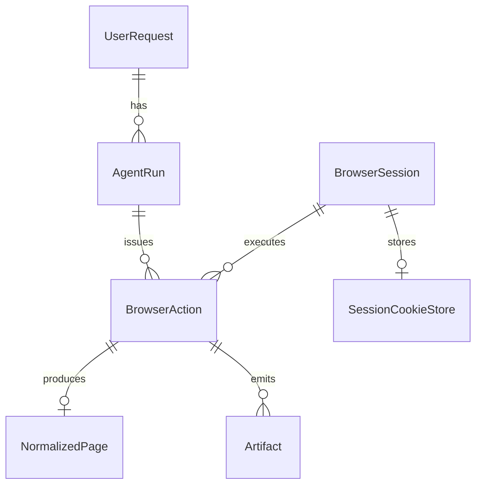

# Steel Platform Data Model and ER Diagram

## 1. Purpose

This document defines the minimum persistent data model for the platform.

## 2. Main Entities

### UserRequest

Represents a user-issued high-level task.

Suggested fields:

- `id`
- `created_at`
- `user_prompt`
- `status`
- `agent_run_id`

### AgentRun

Represents one AI-agent execution context.

Suggested fields:

- `id`
- `created_at`
- `status`
- `current_goal`
- `user_request_id`

### BrowserSession

Represents a reusable browser session.

Suggested fields:

- `id`
- `created_at`
- `status`
- `profile_name`
- `site_scope`
- `last_active_at`

### BrowserAction

Represents one browser command.

Suggested fields:

- `id`
- `session_id`
- `agent_run_id`
- `action_type`
- `request_payload`
- `status`
- `started_at`
- `finished_at`

### NormalizedPage

Represents normalized browser output.

Suggested fields:

- `id`
- `action_id`
- `url`
- `title`
- `page_type`
- `semantic_summary_json`
- `actionable_view_json`
- `metrics_json`

### Artifact

Represents raw artifacts for debugging.

Suggested fields:

- `id`
- `action_id`
- `artifact_type`
- `storage_ref`
- `created_at`

### SessionCookieStore

Represents stored session state.

Suggested fields:

- `id`
- `session_id`
- `cookie_blob`
- `updated_at`

## 3. Entity Relationships

## 4. Notes

### Why Store NormalizedPage Separately

Because:

- it allows debugging of what the agent actually saw
- it helps compare raw artifacts to normalized outputs
- it supports replay and evaluation later

### Why Store Artifact References

Because:

- screenshots and raw HTML should not always live inline in the main records
- large payloads are better stored by reference

## 5. MVP Persistence Recommendation

For the MVP:

- SQLite is acceptable
- JSON fields may be used where convenient

For later growth:

- PostgreSQL is preferable

