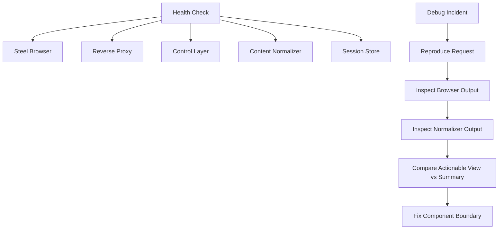

# Steel Platform Operations Runbook

## Purpose

This runbook defines the operational model for the Steel platform.

## Core Services

- `steel-browser`
- reverse proxy
- optional Steel MCP or control gateway
- content normalizer
- optional local SLM
- session store

## Service Health Checklist

### Steel Browser

Checks:

- container is running
- `/` returns API metadata
- `/ui` loads
- local `9223` responds

### Reverse Proxy

Checks:

- domain resolves correctly
- external auth works
- external `/` returns the expected Steel API response

### Control Layer

Checks:

- tool requests reach the browser layer
- basic open-page action succeeds
- timeouts are visible in logs

### Content Normalizer

Checks:

- output is generated for real pages
- token-heavy markup is reduced
- actionable structure is preserved

## Troubleshooting Matrix

| Symptom | Likely Cause | First Check |
|---|---|---|
| `502 Bad Gateway` | proxy cannot reach upstream | verify upstream host and port |
| browser opens but agent fails | control layer mapping issue | inspect MCP or gateway logs |
| huge token usage | raw HTML leaking through | inspect normalizer output |
| wrong clicks | action data polluted | inspect actionable view |
| login instability | missing session persistence | inspect cookie/session store |

## Security Rules

- expose only the required public endpoints
- keep `9223` local-only
- require auth at the proxy
- avoid exposing raw debug endpoints
- preserve audit logs for agent actions

## Recommended Debug Strategy

1. confirm browser health
2. confirm reverse proxy health
3. inspect browser output
4. inspect normalizer output
5. compare semantic summary against actionable view
6. use screenshots or raw HTML refs when needed

## Operations Diagram

## Logging Recommendations

Store at least:

- request ID
- user task summary
- session ID
- target URL
- browser step results
- normalization output size
- screenshots on failure

## Final Operational Principle

The browser is the source of truth for page state.

The normalizer is the optimization layer for agent consumption.

The platform should always preserve a path back to raw artifacts when the summarized output is not enough.

