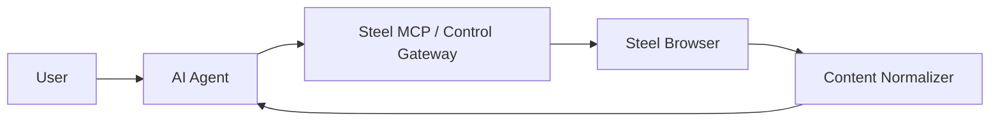

# Steel Platform Product Requirements Document

## 1. Product Name

Working name:

- Steel Platform

Alternative internal description:

- Steel-based browser automation platform for AI agents

## 2. Product Vision

Create a browser automation platform that is more reliable than plain Playwright for difficult websites, while also reducing LLM token waste through structured content normalization.

## 3. Problem Statement

Current browser automation workflows often fail in real-world environments because:

- some sites are hostile to ordinary automation
- login and session handling are brittle
- page outputs are too noisy for efficient AI reasoning
- raw HTML creates excessive token cost

The project needs a platform that improves browser reliability and makes browser outputs easier and cheaper for AI agents to use.

## 4. Target Users

### Primary User

- the project owner or operator who wants AI agents to perform browser tasks on the home server

### Secondary Users

- AI coding agents that will build and extend the platform
- AI automation agents that will consume browser functionality

## 5. User Goals

Users want to:

- automate website interactions more reliably than plain Playwright
- centralize browser execution on the home server
- let AI agents perform multi-step web tasks
- reduce unnecessary token usage
- retain enough detail to safely perform follow-up browser actions

## 6. Product Scope

### In Scope

- Steel Browser runtime
- AI-agent-facing control layer
- content normalization
- session persistence
- optional local SLM preprocessing
- reverse-proxied remote access

### Out of Scope for Initial Versions

- full enterprise RPA
- large local reasoning models as the primary intelligence layer
- public debug interfaces
- broad multi-tenant user management

## 7. Core Product Capabilities

The product must allow an AI agent to:

- request browser actions
- perform navigation and interaction
- receive normalized, compact page outputs
- continue multi-step browsing based on those outputs

## 8. Success Criteria

The project is successful when:

1. browser tasks complete more reliably than the current Playwright-only workflow
2. normalized outputs reduce token-heavy raw HTML exposure
3. the AI agent can continue to the next action using the returned structured output
4. sessions can be reused for real multi-step workflows

## 9. Product Principles

- browser truth comes from the browser runtime
- token savings come from normalization, not from moving MCP alone
- semantic summaries must not corrupt actionable execution data
- the platform should be modular enough for AI agents to build incrementally

## 10. High-Level Product Flow

## 11. Main Product Value

The product combines:

- improved browser execution reliability
- AI-agent-friendly browser access
- lower token costs through normalized page representations

## 12. MVP Definition

The MVP must include:

- running Steel Browser
- browser control interface
- content normalizer
- session persistence basics

## 13. Risks

- over-normalization may corrupt action accuracy
- remote browser access may create security concerns
- session persistence may be harder than initial estimates
- local SLM integration may be useful but not immediately necessary

## 14. Product Outcome

The final product should not be viewed as a single tool.

It should be viewed as a browser automation platform designed specifically for AI-driven workflows.

