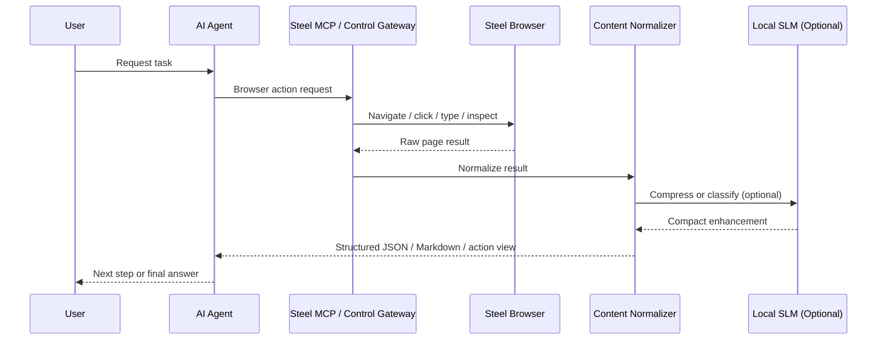
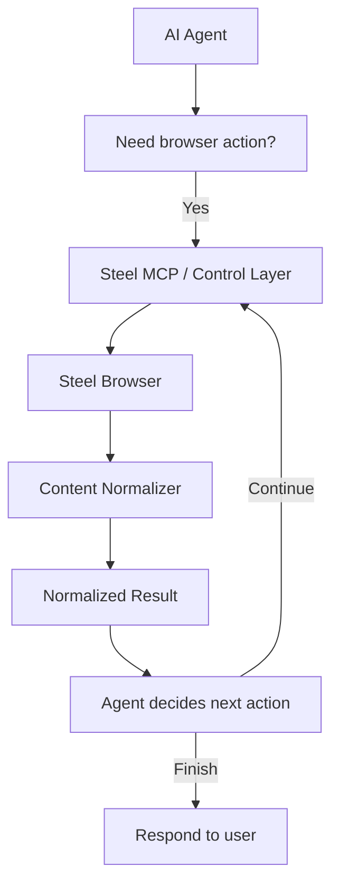

# Steel Platform Request Flow and Sequence

## Purpose

This document explains the exact order in which requests move through the platform.

The key correction is:

- the flow starts with the user
- the AI agent is the decision maker
- Steel MCP or the control layer is the browser interface
- Steel Browser performs execution
- the Content Normalizer prepares results before they are returned to the AI agent

## Primary Flow

### Canonical Request Path

- `user -> AI agent -> Steel MCP/control layer -> Steel Browser -> Content Normalizer -> AI agent`

## Narrative Flow

1. The user asks the AI agent to perform a browser-related task.
2. The AI agent decides that browser interaction is required.
3. The agent sends a command to Steel MCP or the control gateway.
4. Steel Browser performs navigation or interaction.
5. Steel Browser returns raw page results and artifacts.
6. The Content Normalizer removes noise and prepares compact outputs.
7. An optional local SLM performs extra compression or classification when useful.
8. The normalized result is returned to the AI agent.
9. The AI agent decides the next action or produces the final answer for the user.

## Sequence Diagram

## Browser Result Types

Steel Browser may produce:

- current URL
- page title
- raw HTML
- visible text
- screenshot
- links
- buttons
- inputs and form structure
- optional network summaries
- optional console summaries

## What the Agent Should Receive

The agent should usually receive:

- compact page summary
- actionable structured view
- references to deeper artifacts if needed

The agent should not usually receive:

- raw full HTML on every step
- large script blobs
- tracking markup
- excessive layout wrappers

## Decision Loop

## Why This Flow Matters

This order matters because:

- the user remains the true starting point
- the AI agent remains the planner
- Steel Browser remains the execution engine
- the normalizer remains a post-processing layer, not the controller

## Important Constraint

The normalizer should prepare the browser result for agent reasoning, but should not become the authority for browser truth.

The source of truth for the live page remains the browser runtime.

