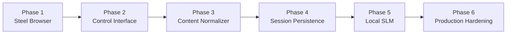

# Steel Platform Implementation Roadmap

## Goal

This roadmap describes how to build the platform in realistic stages.

## Phase 1: Stable Browser Runtime

### Objectives

- deploy Steel Browser on the k12 server
- expose the main API safely through Nginx Proxy Manager
- keep the DevTools port private

### Deliverables

- running `steel-browser` container
- authenticated reverse proxy
- health checks for `/`
- local-only `9223` access

## Phase 2: Browser Control Interface

### Objectives

- provide an AI-agent-friendly browser control interface
- support remote or local MCP usage

### Deliverables

- Steel MCP or custom control gateway
- basic tool commands:
  - open
  - click
  - type
  - wait
  - screenshot
  - extract

## Phase 3: Content Normalizer

### Objectives

- stop sending raw HTML by default
- create compact JSON and Markdown outputs

### Deliverables

- boilerplate removal
- script and style stripping
- main content extraction
- actionable structured view
- semantic summary

## Phase 4: Session Persistence

### Objectives

- improve reliability across multi-step workflows

### Deliverables

- cookie storage
- session metadata
- login reuse strategy
- session recovery behavior

## Phase 5: Local SLM

### Objectives

- improve low-cost preprocessing

### Deliverables

- page classification
- content block ranking
- compact summary refinement

## Phase 6: Production Hardening

### Objectives

- turn the platform into a reliable always-on service

### Deliverables

- logs and metrics
- job queue
- trace and screenshot retention policy
- rate limits
- service dashboards

## Roadmap Diagram

## Recommended Priority

The highest-value order is:

1. browser runtime
2. control interface
3. normalization
4. session persistence
5. optional local SLM

## Why This Order Matters

Because:

- reliability matters before optimization
- browser truth matters before compression
- token savings matter after the system can already complete workflows

