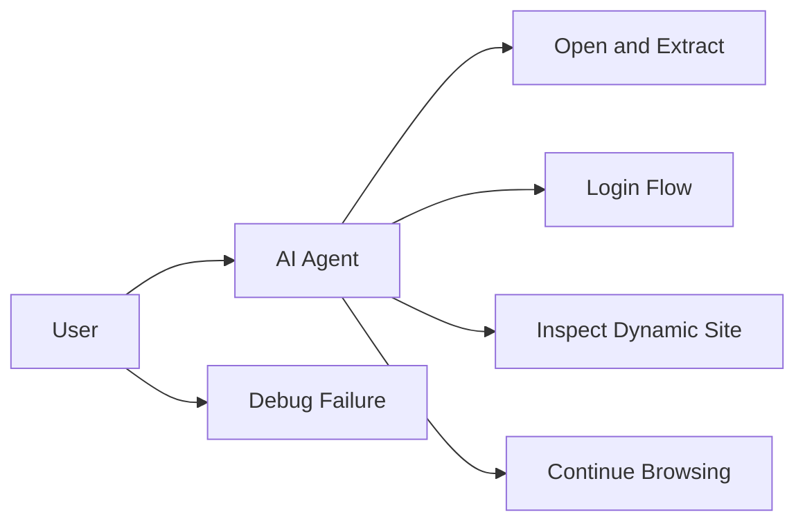

# Steel Platform Use Cases

## 1. Purpose

This document captures the main use cases that the platform must support.

## 2. Actors

- User
- AI Agent
- Steel MCP / Control Gateway
- Steel Browser
- Content Normalizer
- Session Store

## 3. Core Use Cases

### UC-1 Open a Website and Extract Main Content

Actor:

- User through AI Agent

Flow:

1. user asks for data from a website
2. agent requests page open
3. Steel Browser opens the page
4. normalizer extracts compact content
5. agent receives structured result

Expected output:

- title
- main content
- links
- actionable structures

### UC-2 Perform a Multi-Step Login Flow

Actor:

- User through AI Agent

Flow:

1. user asks the agent to log in
2. agent opens the login page
3. agent enters credentials through control layer
4. browser submits the form
5. session store persists resulting cookies
6. later actions reuse that session

Expected output:

- authenticated session reuse

### UC-3 Inspect a Complex Dynamic Website

Actor:

- AI Agent

Flow:

1. agent opens a JavaScript-heavy site
2. browser waits for stability
3. extraction occurs
4. normalizer removes low-value noise
5. agent receives compact view of important content and controls

Expected output:

- usable page structure without full raw HTML

### UC-4 Continue Browsing Based on Prior Output

Actor:

- AI Agent

Flow:

1. agent receives normalized output
2. agent identifies next target from actionable view
3. agent sends click or type action
4. browser continues in the same session

Expected output:

- successful multi-step browsing loop

### UC-5 Debug a Failed Automation Step

Actor:

- Operator or AI Agent

Flow:

1. a browser action fails
2. logs and request IDs are inspected
3. screenshot and raw HTML reference are reviewed
4. actionable view is compared against browser truth

Expected output:

- understanding of whether failure came from browser state, normalizer, or control logic

## 4. Use Case Diagram

## 5. Most Important Use Case

The single most important use case is:

- the AI agent can browse a real site, receive normalized output, and use that output to continue the next browser step

